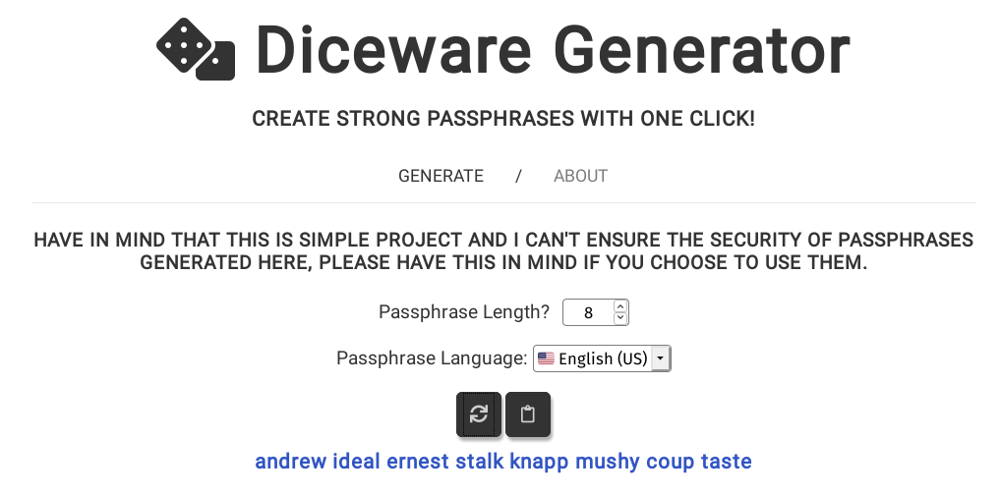

> [!WARNING]  
> This project is no longer maintained or hosted by me. It was created a long time ago when I was beginning to learn JavaScript.
> I've decided to archive this repository as I have no plans to update it, and the code here likely does not follow current best practices.
>
> I'm leaving this repository public in case it might help someone in the future. However, please note that it is probably very outdated by the time you are reading this.

# Diceware generator 🎲
Using weak password or passphrase is still most common mistake users do when securing their accounts and because of that I decided to make this website to show people that creating and memorizing strong passwords/passphrases isn't really that hard.

  

## What indicates strong passphrase?
* Long enough to be hard to guess.
* Not a famous quotation from literature, holy books, et cetera.
* Hard to guess by intuition—even by someone who knows you well.
* Easy to remember and type accurately.
* Not reused between sites, applications and other different sources.

## How this Diceware generator works?
If you are interested how Diceware works with pshychical dice and paper - [here you can read more](http://world.std.com/~reinhold/diceware.html).

If you wonder how this website uses Diceware to generate passphrases for users then this part is for you.

1. First we ask user to type how many words he want to have in his passphrase. The minimum amount of words is 6 and the maximum is 128.

1. Next user can choose in which language he want have his passphrase generated in. **There are currently 12 languages from which user can choose from.**

1. Then, when he hit the button to generate it - in no time is shows below that button.

Everything described below happens as a part of "behind the scenes" - which is really only our small script, that generates and shows passphrases to user.

1. Let's start with saying that **everything described below happens just after clicking button by user** (for ex. we know how many words user want to have generated after he hit 'generate' button, not when he is done typing it).

1. First we need to know **how many words we need to generate**. So we get the number typed by user and check if is within the range (**6-128**) - if it's then we proceed to next step, if not then we show error and stop our script here.

1. Then we **"role our dice" 5 times** (number can be from 1-6, and end result is something like for ex. '11111'.)

1. After we have our number ('11111' in this example) we **check which language** user choosed and then we 'go' to relevant file (every language have own it file).

1. In every language file there is **Array which which starts with lowest possible number (11111) that we can get from "rolling our dice" and ends with highest possible number (66666)**. To every number there's a word/symbol/number asigned. So our passphrase is set of this worlds/symbols or numbers we got from language file.

1. Currently we only have 1 world generated and we need at least 5 more. So we need to **repeat steps 3-5 as many times as user choose worlds**.

1. After all of this we finally have our freshly generated passphrase and we can show it to user below 'Generate' button. :)

## Sources:

* [Original Diceware site](http://world.std.com/~reinhold/diceware.html).
* [Diceware FAQ](http://world.std.com/%7Ereinhold/dicewarefaq.html).
* [Chinese word list](https://github.com/cfbao/chinese-diceware).
* [French word list](http://weber.fi.eu.org/software/diceware/src/francais.wordlist.asc).
* [German word list](http://world.std.com/%7Ereinhold/diceware_german.txt).
* [Italian word list](https://www.taringamberini.com/downloads/diceware_it_IT/lista-di-parole-diceware-in-italiano/3/word_list_diceware_it-IT-3.txt).
* [Japanese word list](http://s3.amazonaws.com/dotclue.org/diceware_jp.txt).
* [Norwegian word list](https://0101.no/diceware/diceware_nb_NO.txt).
* [Polish word list](https://web.archive.org/web/20130420042549/http://drfugazi.eu.org/sites/drfugazi.eu.org/files/dicelist-pl.txt).
* [Portuguese word list](https://gist.github.com/patxipierce/3a96b1927b844ce47c04a242651bafc2).
* [Russian word list](world.std.com/%7Ereinhold/diceware.ru.zip).
* [Spanish word list](http://world.std.com/~reinhold/diceware_espanol/DW-Espanol-1.txt).
* [Swedish word list](https://x42.com/diceware/diceware-sv.txt).

